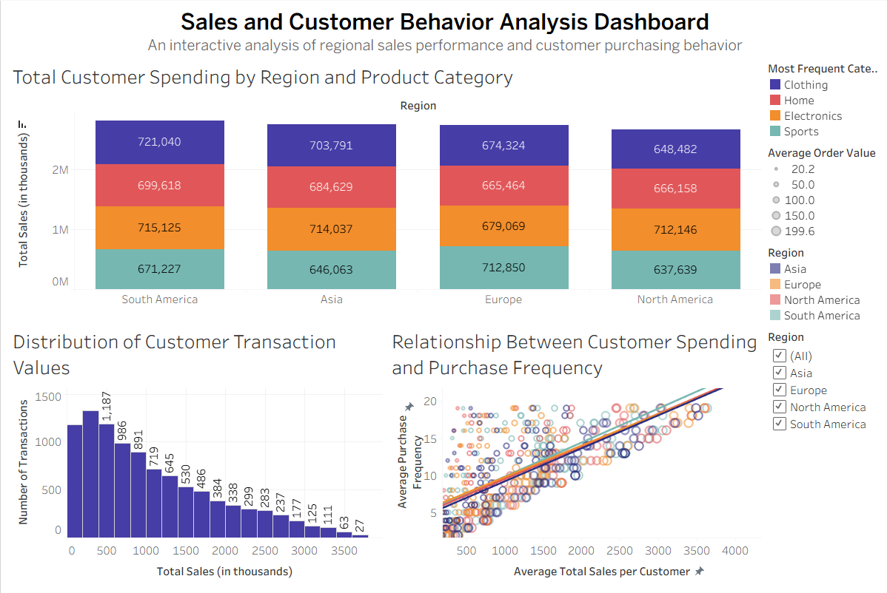

# 📊 Retail Sales & Customer Insights 

A comprehensive data visualization project and research study designed to analyze retail sales performance, customer trends, and regional profitability. Built using **Tableau**, this project transforms the raw "Big Luma" dataset into an interactive, data-driven dashboard that facilitates strategic business decision-making. 

This repository contains the interactive Tableau dashboard and the accompanying academic research paper detailing the design principles, cognitive load considerations, and methodology.

---

## 🎯 Project Objectives

* **📈 Performance Tracking**: Monitor key metrics such as total sales, profit margins, and order volumes over time.
* **🗺️ Regional Analysis**: Identify high-performing geographic areas to optimize distribution and marketing strategies.
* **🛍️ Category Insights**: Analyze product categories and sub-categories to determine primary revenue drivers.
* **📉 Discount Impact**: Evaluate how discounting strategies positively or negatively affect overall profitability.

---

## 🛠️ Tech Stack & Tools

* **Visualization Tool**: Tableau / Tableau Public
* **Data Processing**: Excel / CSV Data Preparation
* **Design Principles**: Information Visualization Theory, Data-Ink Ratio optimization, and Color Theory
* **Dataset**: Big Luma Retail Dataset

---

## 🧠 Methodology & Research Focus

As part of an Information Visualization academic paper, this dashboard was designed with strict adherence to data visualization best practices:

1. **Visual Encoding**: Strategic use of color hues and saturation to highlight profitability (e.g., separating profitable regions from loss-making ones).
2. **Cognitive Load Reduction**: Minimizing clutter by utilizing clean tooltips, intuitive filters, and a logical visual hierarchy so stakeholders can digest insights instantly.
3. **Interactive Storytelling**: Implementing dashboard actions (filter and highlight actions) in Tableau to allow users to drill down from macro-level regional data to micro-level product performance.

---

## 📈 Key Dashboard Features

* **📅 Time Series Analysis**: Dual-axis charts tracking sales and profit trends across different months and quarters.
* **🌍 Geospatial Mapping**: Interactive Tableau map highlighting sales volume and profitability by state/region.
* **📊 Category Breakdown**: Sorted bar charts comparing revenue contributions across different product lines.
* **🔍 Interactive Filters**: Dynamic slicers for Date, Category, and Region, allowing users to interact with the data dynamically.

---

## 🔗 Project Links

* **Live Interactive Dashboard**: [YOUR_TABLEAU_PUBLIC_LINK_HERE](https://public.tableau.com/app/profile/abdulrahman.alamodi6148/viz/Sales_and_Customer_Insights_17723553039370/SalesandCustomerInsightsDashboard?publish=yes)

---

## 📁 Project Visuals

*(Ensure these image files are uploaded to your repository in the same folder as this README)*

### 🖥️ Dashboard

---

## 👥 Group Members

This project was collaboratively researched and developed by:

* 👤 **Abdulrahman Alamodi** 
* 👤 **Habiba Hassan Nur Hassan** 
* 👤 **Osamah Alrusabi** 
